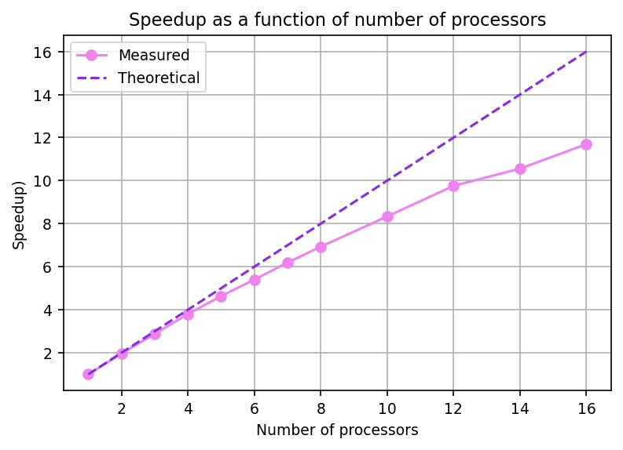

# The two-dimensional diffusion problem in parallel

This Fortran program solves the unsteady, two-dimensional temperature diffusion equation.

$$ 
\frac{\partial T}{\partial t} = D \nabla^2T = D \left(  \frac{\partial^2 T}{\partial x^2} + \frac{\partial^2 T}{\partial y^2}\right) 
$$

Here *T* is the temperature to be solved and *D* the diffusion constant. 


### Problem definition

The chosen domain is the unit square, such that $(L_x, L_y) = (1, 1)$. The initial condition $T(x, y, t=0) = 0$ is used. 

Dirichlet boundary conditions are used to model an unsteady diffusion of heat from the bounds of the unit square towards the origin:

$$
T(x, 0, t) = T(x, L_y, t) = T(0, y, t) = T(L_x, y, t) = 1.
$$


### Discretisation 

A uniform Cartesian grid is chosen for simplicity. The grid sizes are expressed below. 

$$
\Delta x = \frac{L_x}{N_x - 1} \qquad \Delta y = \frac{L_y}{N_y - 1}
$$

An explicit Eulerian time integration produces the centered algorithm integrated in this Fortran code. 

$$
\frac{T_{i,j}^{n+1} - T_{i,j}^n}{\Delta t} = D \left( \frac{T_{i+1, j}^n - 2 T^n_{i,j} + T^n_{i-1,j}}{\Delta x^2} + \frac{T_{i, j+1}^n - 2 T^n_{i,j} + T^n_{i,j-1}}{\Delta y^2} \right)
$$

This program uses $D = 1$ as the default.


### Features

Input data (domain information, diffusion constant and similar) can be read in from a file `input_data.dat` or manually defined in the module `inputs.f90`. 

The CPU and wall lock time can be measured using the timings routines included. 

This program will use MPI for parallelisation. Exchange of domain boundaries between communicators is handled by `module_bounds.f90`. 

Included is a basic `python` visualisation script for providing insights from timing data.




### Execution 

To run the code: 

```
make new
mpirun -n <number_of_processes> ./diffusion
```

***

### Credits 

Developed by Elloïse Fangel-Lloyd, Dana Lüdemann and Clemens Zengler. 


